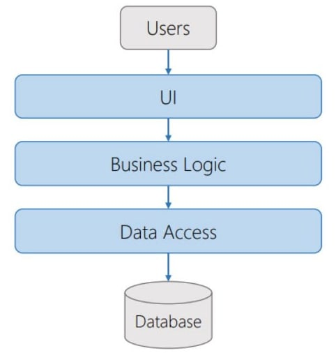

# Introduction

`Built on .Net Core 3.1`

`Uses a local Microsoft SQL server.`

The following NuGet packages are included in this project:
  1. API:
     - Microsoft.AspNetCore.Mvc.NewtonsoftJson - [Link](https://www.nuget.org/packages/Microsoft.AspNetCore.Mvc.NewtonsoftJson/3.1.28?_src=template)
     - Microsoft.EntityFrameworkCore.Design - [Link](https://www.nuget.org/packages/Microsoft.EntityFrameworkCore.Design/5.0.17?_src=template)
     - Microsoft.EntityFrameworkCore.SqlServer - [Link](https://www.nuget.org/packages/Microsoft.EntityFrameworkCore.SqlServer/5.0.17?_src=template)

  2. BLL:
     - AutoMapper - [Link](https://www.nuget.org/packages/AutoMapper/11.0.1?_src=template)
     - AutoMapper.Extensions.ExpressionMapping - [Link](https://www.nuget.org/packages/AutoMapper.Extensions.ExpressionMapping/5.1.0?_src=template)
     - CsvHelper - [Link](https://www.nuget.org/packages/CsvHelper/28.0.1?_src=template)
     - Microsoft.AspNetCore.Http.Features - [Link](https://www.nuget.org/packages/Microsoft.AspNetCore.Http.Features/5.0.17?_src=template)

  3. DAL:
     - Microsoft.EntityFrameworkCore - [Link](https://www.nuget.org/packages/Microsoft.EntityFrameworkCore/5.0.17?_src=template)
     - Microsoft.EntityFrameworkCore.Design - [Link](https://www.nuget.org/packages/Microsoft.EntityFrameworkCore.Design/5.0.17?_src=template)
     - Microsoft.EntityFrameworkCore.SqlServer - [Link](https://www.nuget.org/packages/Microsoft.EntityFrameworkCore.SqlServer/5.0.17?_src=template)
     - Microsoft.EntityFrameworkCore.Tools - [Link](https://www.nuget.org/packages/Microsoft.EntityFrameworkCore.Tools/5.0.17?_src=template)

## Built-in 3-tier architecture

## API Controllers included:
- CsvFileController:
  - `POST(ROUTE:api/csvfile/single)` UploadFile - Accepts a CSV file and transfers its data to the database
- PersonController:
  - `GET(ROUTE:api/person/{id})` GetById - Returns a record by id
  - `GET(ROUTE:api/person/name/{name})` GetByName - Returns all records of people by first or last name
  - `GET(ROUTE:api/person/email/{email})` GetByEmail - Returns all records of people by email
  - `GET(ROUTE:api/person/all)` GetAll - Returns all records from a table in a database
- SkillController:
  - `GET(ROUTE:api/skill/{id})` GetById - Returns a record by id
  - `GET(ROUTE:api/skill/name/{name})` GetByName - Returns all skill records by name
  - `GET(ROUTE:api/skill/all)` GetAll - Returns all records from a table in a database
- PersonSkillController
  - `GET(ROUTE:api/personskill/{id})` GetById - Returns a record by id
  - `GET(ROUTE:api/personskill/all)` GetAll - Returns all records from a table in a database

### Sample CSV file with random data for testing 
#
